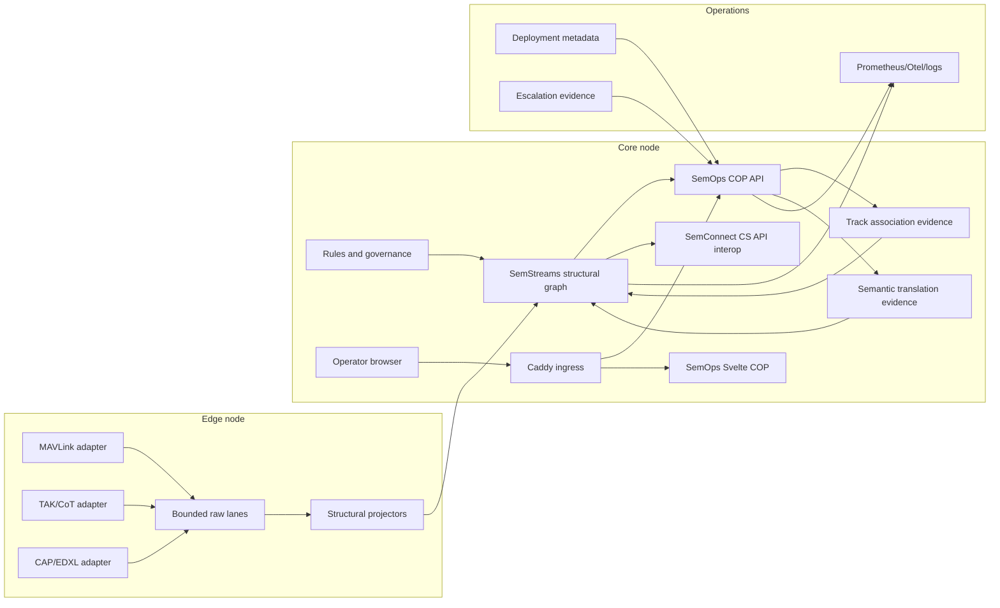

# SemOps COP Demo Revival Architecture

## Status

Draft baseline for the SemOps revival, created on 2026-06-17.

Inputs:

- Claude's SemOps COP demo plan in `SemOps-COP-Demo-Plan.md`.
- Current SemOps checkout at `/Users/coby/Code/c360/semops`.
- Current SemStreams checkout at `/Users/coby/Code/c360/semstreams`.
- Current SemLink checkout at `/Users/coby/Code/c360/semlink`.
- Feed validation and indexing ladder in `docs/feed-validation-and-indexing-ladder.md`.

## Executive Direction

SemOps should come back as a greenfield data-fusion common operating picture and integration lab. It should be
large, bold, and allowed to break old assumptions. The old SemOps code is not the architecture; it is salvage.

Product boundary:

- SemOps owns the COP product, HA/DR scenario, feed adapters, domain vocabulary, fusion behavior, operator UI,
  scenario playback, and product-scoped governance.
- SemStreams owns the substrate: NATS/JetStream, graph mutation/query contracts, projection contracts,
  ownership claims, indexing profiles, rule processing, and tiered structural/statistical/semantic services.
- SemConnect owns the standards-facing OGC Connected Systems API bridge and conformance evidence while SemOps keeps
  native feed ingestion and governed COP state as the product core.
- SemLink remains useful prior art for the modern GCS UI pattern, source-aware graph lens, TAK bridge, CS API bridge,
  and bounded raw telemetry lane. SemLink should stay a basic demo unless explicitly rechartered; SemOps owns the
  complete COP product going forward.

SemOps should act as both consumer and producer for SemStreams improvement. Build product-specific pieces here,
then upstream generic manifest, governance, tiering, indexing, and provenance needs only once the demo proves them.

OpenSpec source: `openspec/changes/revive-cop-product`.

Scope gate: orchestration, topology panels, and tier controls are hypotheses, not accepted Phase 1 features.

Feed gate: feeds are added one at a time. MAVLink and TAK/CoT are first, CAP follows, and KLV stays a proof spike
until video/KLV fixtures prove binary-by-reference and memory-bounded handling.

Review gate: adversarial reviews are required at key stage boundaries. Reviews should challenge product value,
framework ownership, evidence quality, compliance language, index-profile decisions, and demo credibility before the
next implementation tranche begins.

CS API gate: CS API is an interface, not the SemOps internal architecture. SemOps should ingest native feeds close to
their source, project them into SemStreams governed graph state, and use a bidirectional CS API bridge for systems that
already speak or need to consume CS API. That preserves product velocity, semantic graph flexibility, and standards
risk isolation while still giving SemOps a standards-facing interoperability story.

Breaking-tag gate: SemStreams issue #1 tracks the ADR-055/056 must-exist flip for SemOps. SemOps should prove
generated or replay MAVLink frames against the live SemStreams graph path before PX4/SITL, UI, or second-feed
expansion. PX4/SITL remains feed-fidelity evidence; it is not the prerequisite for born-first graph compliance.
The first generated-frame smoke passed on 2026-06-17. Follow-up clean-stack runs also registered SemOps COP owners
and used typed owner tokens minted by SemStreams registry/bind results. The hosted `cmd/semops` composition root now
registers COP owners before composing the MAVLink and TAK/CoT adapters. The Docker Compose smoke now starts NATS,
SemStreams graph backend, SemOps runtime/API, Svelte UI, and Caddy; polls health, metrics, API, UI, and Svelte
immutable assets; sends generated MAVLink and CoT seed events over hosted UDP listeners; waits for the Caddy-routed
COP snapshot to show graph-backed track/task/advisory state; then runs direct MAVLink, CoT, and CAP live graph smokes.
SemStreams health uses its dedicated listener on container port `8081`, mapped to host port `18080`, so it does not
race the service-manager HTTP port. CAP is deliberately proved as append-only hazard evidence, not authoritative
hazard state. The COP now derives CAP hazard lifecycle status from evidence for readback. The
`semops-scenario-runner` service now runs the first HADR
flood/evacuation fixture against the live SemStreams graph in Compose, exposes `/healthz` plus `/scenario/status`,
and the stack smoke asserts the Caddy-routed COP snapshot contains the scenario MAVLink track, TAK/CoT task/advisory,
and CAP hazard. Remaining structural evidence is hosted CAP polling, shared-airspace playback, operator scenario
controls, and durable checkpoint/read-back reconciliation.

UI gate: the frontend starts as a clean-sheet Svelte 5/SvelteKit COP using MapLibre GL JS for the basemap and deck.gl
for high-rate tactical overlays. Dynamic ontology-generated UI is not a Phase 1 feature. Ontology and projection
metadata should hydrate inspectors, provenance, filters, legends, and confidence/freshness badges; SemOps owns the
operator views.

## Live Repo Findings

SemOps started materially stale; the first revival slices are correcting that:

- SemOps now declares Go `1.26.3` and imports current `github.com/c360studio/semstreams`.
- `go test ./...` passes for the active product compile path.
- `cmd/semops/main.go` now loads env config, starts the hosted SemStreams/COP ownership runtime, and can opt into
  MAVLink UDP datagram ingestion with `SEMOPS_MAVLINK_UDP_LISTEN_ADDR`; it can also opt into TAK/CoT UDP/TCP graph
  writes with `SEMOPS_COT_ENABLED`. API/UI readback for CoT state, monitoring services, TCP/serial MAVLink transport,
  and dedicated adapter-process packaging remain open.
- `compose.cop.yml` starts NATS, SemStreams graph backend, SemOps runtime/API, Svelte UI, Caddy, and the hosted
  scenario runner for the current graph smoke scaffold plus first browser-facing COP path.
- `internal/scenario` now provides a deterministic HADR flood/evacuation runner core that exercises MAVLink,
  TAK/CoT, and CAP lifecycle replay through the same adapter/projector seams used by hosted graph writes. Container
  packaging is now present through `cmd/semops-scenario-runner`; an operator/API control surface and the
  shared-airspace vignette remain open. The one-command stack smoke now verifies the runner's graph writes are
  product-visible through the same-origin COP snapshot.
- `configs/robotics-flow.json` describes an old StreamKit-style flow and not the current SemStreams graph ingest
  and projection contract surface.
- Old EntityStore, ObjectStore, StreamKit, and BaseProcessor product paths have been removed from the active build.
- The active frontend tree is a clean-sheet Svelte 5 COP in `ui`; the old flow-runtime UI idea should be treated as
  historical context, not a surface to restore.

SemOps has salvageable MAVLink depth:

- It contains a MAVLink v1/v2 parser with registered message specs for heartbeat, global position, attitude, battery,
  COMMAND_LONG, and COMMAND_ACK.
- It contains a test message generator, parser tests, command codec tests, and raw-lane tests.
- Non-reference StreamKit, BaseProcessor-era MAVLink code, and ignored SITL references have been removed after useful
  command encoding and ACK parsing moved into the active adapter.
- A bounded MAVLink raw frame lane now stores copied frames under record and byte caps and annotates decoded packets
  with source references for governed current-state projections.
- A file-backed MAVLink replay store now persists raw-lane records as JSON Lines fixtures for deterministic parser
  replay before scenario-runner wiring.
- An in-process MAVLink adapter harness now composes parse, raw capture, projection, graph plan writing, and pollable
  health counters before the future container service boundary.
- A SemStreams NATS requester adapter now routes graph mutation writers through `RequestWithRetry`, preserving the
  framework's mutation retry rule for transient responder startup races.
- A structural wiring factory now composes the MAVLink parser, raw lane, projector, retry-aware graph requester, graph
  writer, and adapter harness from config so service hosting can stay thin.

SemOps now has TAK/CoT depth beyond prior-art replay:

- A dependency-light CoT codec, bounded raw lane, JSON Lines replay store, and UDP/TCP fixture harness live in the
  active SemOps tree.
- A CoT projection planner maps operator/air tracks to `signal`, markers to `control` tasks, and GeoChat to
  `content` advisories while preserving raw source refs.
- A CoT graph writer and adapter graph path now follow the same born-first and restart reconciliation discipline as
  MAVLink.
- The hosted runtime can compose CoT behind explicit `SEMOPS_COT_ENABLED` and UDP/TCP listener settings, and the COP
  API/UI now reads graph-backed CoT tracks, tasks, and advisories for configured seed UIDs.

SemLink has the more current product pattern:

- Raw high-rate MAVLink frames stay on a bounded stream lane.
- Current vehicle state is collapsed into one signal-profiled graph entity per vehicle.
- Alerts and commands are control-profiled graph entities.
- Projection contracts declare ownership and indexing profiles before writing through SemStreams graph mutation
  subjects.
- A Svelte 5 dashboard and CS API bridge already prove the operator and standards-projection shape.

## COP UI Baseline

The starting UI stack is recorded in `docs/cop-ui-stack.md` and
`openspec/changes/revive-cop-product/specs/cop-ui-experience/spec.md`.

The product direction is:

- Svelte 5/SvelteKit for the product shell, panels, stores, subscriptions, and component tests.
- MapLibre GL JS for the open WebGL basemap, camera, terrain, labels, and map controls.
- deck.gl for tactical overlays: high-rate tracks, trails, hazards, footprints, picking, filtering, and temporal
  layers.
- loaders.gl as an optional parser helper for formats such as GeoJSON, WKT/WKB, glTF, 3D Tiles, and imagery.
- Threlte only for selected-entity 3D detail views where a 2D/2.5D map layer is insufficient.

The browser should consume SemOps API snapshots and bounded deltas, not connect directly to NATS in Phase 1. Native
packets, raw frames, graph mutation detail, and replay trace events stay behind SemOps API unless a deliberate
operator or diagnostic lens exposes them.

The first implemented browser path runs through Caddy in local Compose. Caddy serves the Svelte COP and proxies
`/api/*` plus `/healthz` to SemOps API so local development sees the same-origin shape the deployed product should
use. The snapshot endpoint now prefers SemStreams `graph.query.prefix` discovery for MAVLink, TAK/CoT, and CAP COP
entity prefixes, maps graph triples into a curated COP view model, and uses seeded point reads only as
family-scoped compatibility fallback when discovery is disabled, unavailable, or empty for that feed family. The
Compose path relies on discovery for CoT/CAP snapshot state rather than configured seed UID lists.

Dynamic UI is scoped narrowly:

- Accepted: dynamic population, styling, filtering, and timeline behavior inside product-owned layer types.
- Accepted: ontology and projection metadata in inspector fields, provenance explanations, legends, filters, and
  confidence/freshness badges.
- Deferred: automatic operator layouts, workflows, alerting, command controls, or new map layers generated from
  ontology structure.

The short rule is: ontology hydrates the inspector; SemOps owns the view.

## Design Principles

1. Raw feeds stay raw at the boundary. The graph gets current state, durable events, provenance, confidence, and
   relationship evidence, not one entity per packet.
2. Every adapter writes through SemStreams ADR-055/056 projection and ownership contracts. Entity birth is explicit,
   foreign edges derive `ForeignEdgeClaim` records, and no feed silently clobbers another feed's predicates.
3. Loose feeds use tolerant readers at the boundary and strict governed writes into the graph.
4. Structural is the default operating mode. Statistical and semantic inference are recorded as evidence with
   visible justification before they become any kind of control surface.
5. Container boundaries follow deployment concerns: independent placement, scaling, external network protocols,
   secrets, expensive inference, or different failure domains.
6. Library/component boundaries follow code reuse concerns: codecs, canonical mappers, entity models, vocabulary,
   projection contracts, and deterministic fusion rules.
7. SemOps can evaluate tier-placement and escalation behavior, but only after a concrete operator-value case exists.
8. Adversarial reviews are part of the delivery plan. A stage is not ready because it is plausible; it is ready after
   architect, reviewer, and technical-writer roles have tried to break the assumptions and recorded the result.

## Born-First Graph Discipline

SemOps accepts the SemStreams breaking-change direction before rebuilding feed adapters:

- New entities are born with `graph.CreateEntityWithTriplesRequest`, `MessageType`, and `IndexingProfile`.
- Current-state changes use `graph.UpdateEntityWithTriplesRequest` against entities that already exist.
- Adapters must not rely on `triple.add` or `triple.add_batch` auto-vivify.
- Cross-entity relationships must be declared in projection contracts so SemStreams derives
  `ownership.ForeignEdgeClaim` values.
- MAVLink and TAK `cop.track.source` edges are strict born-first edges. The source `asset` entity must exist before
  the track edge is written.
- `EdgeNoBirthStub` is a reviewed exception for targets that have no independent producer, not a general fallback.
- SemOps issue #1 is the external tracker for proving this path against the upcoming SemStreams must-exist tag.
- The first compliance proof passed as a live generated-frame MAVLink graph smoke with source asset, track,
  `cop.track.source`, and `cop.track.position` readback.
- Follow-up clean-stack proofs registered COP owners, enrolled them for heartbeat, and used typed owner tokens minted
  by SemStreams registry/bind results.
- The hosted `cmd/semops` composition root now connects to SemStreams, registers COP owners, enrolls heartbeat, and
  passes typed owner tokens into the MAVLink adapter wiring.
- SemStreams accepted the SemOps feedback to add typed, opaque owner-token minting on the registry/bind-result path
  and to split append-evidence declarations from enforceable ownership/write-fence claims. SemOps now consumes that
  typed token path for MAVLink.
- The first one-command graph smoke passes through `scripts/cop-stack-smoke.sh`; it starts the graph scaffold, polls
  health, metrics, API, UI, Svelte immutable asset caching, the hosted MAVLink UDP-to-snapshot path, and the direct
  MAVLink live graph smoke before tearing the stack down.
- SemOps removed the local Go module replace and pins `github.com/c360studio/semstreams v1.0.0-beta.113`, the
  prefix-discovery contract tag that follows the shipped ADR-055 must-exist flip.
- The 2026-06-19 post-prefix-discovery-tag smoke passed against `v1.0.0-beta.113`: focused graph snapshot tests,
  `go test ./...`, `go build ./cmd/semops`, and `bash scripts/cop-stack-smoke.sh`.
- The one-command smoke now prints NATS/SemStreams diagnostics on compose startup failure. This caught a local Docker
  Desktop storage condition where NATS JetStream reported `Max Storage: 0 B`; after pruning unused Docker build cache
  and moving SemStreams dedicated health off the service-manager port, the stack smoke passed again.
- SemStreams currently warns that `semops.feed.cap` has no enforceable ownership claim because it is
  append-evidence-only. That matches the intended split between evidence-contribution declarations and write-fence
  ownership, but SemOps should keep watching the tag for any bind-result/token behavior change on append-only
  contributors.
- CAP now has a local parser, raw XML lifecycle fixture replay, born-first append-evidence projection planner/writer,
  graph-backed COP hazard readback, and derived lifecycle status in the COP view model. It is still not a hosted
  CAP/NWS service and does not claim CAP consumer conformance.
- Remaining compliance hardening requires source/type cardinality alerting and pagination guidance, CAP schema/NWS
  validation expansion, and durable checkpoint/read-back reconciliation.

## CS API Positioning

SemOps should use a native core plus standards bridge posture.

Native adapters are the fast path for operational feeds: MAVLink, TAK/CoT, CAP/EDXL, ADS-B, SAPIENT, and KLV can
arrive in disaster-response environments without a standards driver in front of them. SemOps should decode those
formats at the boundary, preserve their native semantics where they matter, and project governed current state,
evidence, provenance, freshness, and confidence into SemStreams.

CS API remains valuable at the ecosystem edge. It can decouple standards-aware clients, support systems that already
publish CS API, expose SemOps state to federated consumers, and provide a unified vocabulary for standards-facing
tasking. Those benefits do not require making CS API the COP's internal language. If CS API mappings evolve, the bridge
should absorb that change; the native adapters and COP model should not be hostage to an external standards lifecycle.

## Adversarial Review Gates

Run adversarial reviews before:

- Modernizing the SemStreams contract, to catch old StreamKit assumptions and accidental framework drift.
- Declaring the COP entity/predicate model stable, to catch ownership conflicts, born-first gaps, and product-only
  vocabulary.
- Adding each Phase 1 feed to the stack, to catch missing parser, replay, compliance, and indexing-profile evidence.
- Promoting orchestration, topology, or tier UI, to prove operator value and avoid building a footgun.
- Starting SAPIENT or KLV product work, to verify authoritative fixtures and honest compliance/binary claims.
- Filing upstream SemStreams issues, to separate product-specific pressure from reusable framework requirements.

Each review should leave a short record: decision, objections, evidence checked, accepted risks, and follow-up tasks.

## System View

## Containerized Services

Use services where deployment isolation matters. The first structural demo should start with a single Compose
stack, then split edge/core only after the deployment metadata has real value.

| Service | Owner | Why it is a service | First phase |
| --- | --- | --- | --- |
| `nats` | Infra | Durable streams, KV buckets, request/reply, observability port | Phase 0 |
| `semstreams-structural` | SemStreams | Graph ingest, graph query, rule processor, structural indexes | Phase 0 |
| `caddy` | Infra | Same-origin browser ingress for SemOps UI and API paths in dev/demo stacks | Phase 1 |
| `semops-api` | SemOps | COP snapshot API, SSE, commands, source/provenance views | Phase 1 |
| `semops-ui` | SemOps | Svelte COP product surface; may be served by `semops-api` | Phase 1 |
| `semops-scenario-runner` | SemOps | Scripted HA/DR feed playback, deterministic demo clock | Phase 1 |
| `semops-adapter-mavlink` | SemOps | External UDP now; TCP/serial/SITL boundary and raw lane producer later | Phase 1 |
| `semops-adapter-cot` | SemOps | TAK UDP/TCP/XML boundary and operator/marker/message projection | Phase 1 |
| `semops-adapter-cap` | SemOps | Tolerant CAP/EDXL reader and hazard/advisory projection | Phase 1 |
| `semops-adapter-sapient` | SemOps | Protobuf boundary and strict detection/track projection | Phase 2 |
| `semops-adapter-adsb` | SemOps | Air-track source, raw JSON first, ASTERIX later | Phase 2 |
| `semops-adapter-klv` | SemOps | Video metadata/footprint extraction from STANAG 4609 KLV subset | Phase 3 |
| `semops-track-association` | SemOps | Statistical tier for ambiguous cross-source track association | Phase 2 |
| `semops-translation-agent` | SemOps | Semantic tier for civilian advisory translation and explanations | Phase 3 |
| `semconnect-csapi` | SemConnect | Standards ingress/egress bridge and conformance surface | Phase 3 |
| `observability` | Infra | Prometheus/Otel/log aggregation for active demo monitoring | Phase 0 |

Do not make each deterministic mapper its own service by default. A mapper becomes a service only when it owns an
external protocol boundary, needs separate placement, or has a different failure/scaling profile.

## SemOps Components

These belong inside the SemOps codebase even when a container hosts them.

| Component | Role | Notes |
| --- | --- | --- |
| `pkg/adapters/mavlink` | MAVLink codec, raw lane, replay, commands | Active parser/generator extracted |
| `pkg/adapters/cot` | TAK/CoT codec, raw lane, replay fixtures | Active parser/replay subset |
| `pkg/cop` | COP model, predicates, projection contracts | Track, alert, asset, hazard, footprint, task, advisory |
| `internal/adapters/mavlink` | MAVLink adapter harness | Parse, raw capture, project, write, health |
| `internal/adapters/cot` | TAK/CoT adapter harness | Decode, raw capture, project, write, health |
| `internal/graphrequest` | SemStreams request/reply adapters | Retry-aware mutation request boundary |
| `internal/projectors/mavlink` | Decoded MAVLink packets to graph mutation plans | Born-first current-state planner |
| `internal/projectors/cot` | Decoded CoT events to graph mutation plans | Track, task, advisory planner |
| `internal/scenario` | Deterministic HA/DR scenario runner core | Replays MAVLink, TAK/CoT, and CAP fixtures through real seams |
| `cmd/semops-scenario-runner` | Hosted one-shot scenario service | Runs HADR replay and exposes status/health for active polling |
| `internal/stack` | Testable service composition factories | Wires SemStreams clients, writers, adapters |
| `internal/projectors/*` | Boundary payload to graph projection mappers | One projection owner per feed or flow |
| `internal/fusion` | Structural fusion and deterministic correlation | Geofence, dedupe, stable-ID match, warnings |
| `internal/deployment` | Deployment metadata and health state | Build only after operator-value review |
| `internal/inference` | Inference evidence and transition records | Evidence first, UI later |
| `ui` | Clean-sheet Svelte 5/SvelteKit COP product surface | MapLibre, deck.gl, source lens, provenance lens, alerts |

## First Canonical Entity Set

Keep the first model small and strong:

- `track`: moving thing with source evidence, position, velocity, identity, and confidence.
- `asset`: responder, platform, vehicle, sensor, infrastructure, or resource.
- `hazard_area`: flood, fire, plume, debris, exclusion zone, or evacuation polygon.
- `sensor_footprint`: observed area from drone/video/sensor metadata.
- `alert`: rule or source alert with severity, active state, and affected entities.
- `task`: requested action or operator intent.
- `advisory`: semantic-tier translation meant for civilian or cross-agency consumption.

Each feed should own only its source-specific predicate group. Cross-source fusion should append evidence or write
separate derived predicates under a fusion owner.

## SemStreams Framework Pressure

The SemOps revival should produce concrete upstream asks, not vague "platform needs":

- A reusable deployment metadata schema only if service placement becomes operator-relevant.
- A reusable escalation event/status vocabulary only if inference transitions generalize.
- Better first-class provenance and confidence conventions for projection contracts and graph triples.
- Indexing profile and cardinality guard improvements only after mixed COP feeds prove current `signal`, `control`,
  `content`, and `trace` profiles are insufficient with clean entity boundaries.
- Spatial and temporal query helpers tuned for COP workflows: polygon intersection, nearest track, stale track,
  and moving object windows.
- A documented raw-lane plus current-state projection pattern for high-rate telemetry.
- Edge/core sync guidance for structural edge nodes and inference-heavy core nodes.
- Governance helpers for tolerant-reader adapters that append evidence without replacing owned predicates.

SemOps should stress current indexing behavior deliberately:

- MAVLink, ADS-B, TAK position events, SAPIENT detections, and KLV sensor positions are high-rate `signal`.
- Alerts, tasks, commands, feed health, scenario state, and standards bridge state are durable `control`.
- CAP advisory text, operator notes, chat text, and semantic explanations are `content`.
- Replay steps, native packet references, and decode logs are `trace`.

If those boundaries fail, file a SemStreams ask with a failing SemOps fixture rather than inventing SemOps-only
profile semantics.

## Phased Execution

### Phase 0: Stabilize The Contract

- Move SemOps to current Go and current `github.com/c360studio/semstreams` module path.
- Quarantine or remove old StreamKit processor assumptions that do not match the current framework surface.
- Add a small compile-time test for projection contracts and ownership claims.
- Define the first canonical COP entity set and feed ownership matrix.

### Phase 1: Structural COP

- Prove the ADR-055/056 must-exist gate with generated or replay MAVLink against a live SemStreams graph path before
  expanding simulator fidelity, UI, or second-feed work.
- Build the structural stack with NATS, SemStreams, SemOps API, SemOps UI, and scripted feeds.
- Use MAVLink, TAK/CoT, and CAP first because they prove high-rate telemetry, operator COP, and loose civilian
  alerts.
- Show deterministic fusion: hazard polygon intersects an asset, stale track detection, low-battery alert, and
  source-aware provenance.

### Phase 2: Air Picture And Statistical Escalation

- Add ADS-B and SAPIENT feed boundaries.
- Add a statistical track association service for ambiguous air tracks.
- Write association evidence back to the graph; add UI only if it helps operator decisions.

### Phase 3: Semantic Translation And Standards Interop

- Add KLV footprint extraction and CS API bidirectional interop through SemConnect.
- Add the semantic translation service for civilian advisories and anomaly explanation.
- Expose provenance and trajectory for every semantic answer.

### Phase 4: Edge/Core Split

- Run structural feeds and deterministic fusion at the edge.
- Run statistical and semantic tiers at the core.
- Use deployment metadata only where it helps edge/core operation.
- Add scripted failover/offline behavior only after the single-stack demo is stable.

## Open Decisions

- Exact entity ID scheme for SemOps COP entities.
- Predicate ownership matrix for each feed and derived fusion owner.
- Whether to reuse SemLink UI components directly or port only the patterns into a new SemOps product surface.
- Whether deployment metadata or tier UI is a value add or a footgun.
- How much SAPIENT and KLV to implement for demo-grade fidelity before claiming conformance.
